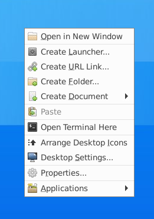
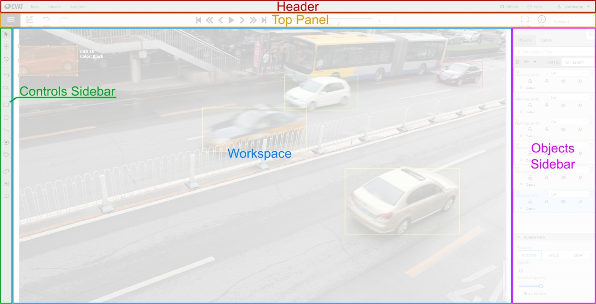
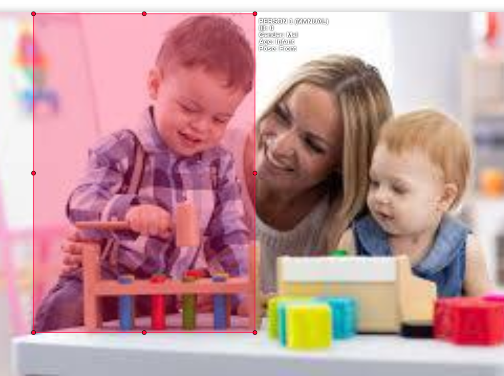

# CVAT Annotation Tool - User’s Manual

Anam Zahra, Manuel Bohn

December 2020


In this document we introduce you to use the CVAT annotation tool for
the videos annotation for our QuantEx project.
In these videos you will encounter people ranging from infants to adults. In
some scenes, people might be partly occluded so that only body parts might
be visible. Other than people there are toys in these videos. At the moment
the goal is to annotate all visible people, regardless of whether they are partly
occluded.
The tool that will be used is called the CVAT, you will find the tool set on
your machine and tasks created for you already. All that you have to do
is follow the instructions below and the ones explained to you in person to
annotate data.

## Connection to Server

In order to connect to the Machine Learning server, you should be connected
through VPN. Thus, start the VPN on your PC and follow the instructions
given in section below.

1.1 Graphical User Interface

X2go will be used to have graphical user interface for the ease of users. First
of all, we explain the installation steps for X2Go.
Install the Client version with respect to your Operating System as follows:

- open [https://wiki.x2go.org/doku.php/download:startin](https://wiki.x2go.org/doku.php/download:startin) your browser.
- Under the X2go Client download the X2Go client as per your OS.

    <p align="center">
      
    </p>


- Once downloaded install it as per your OS. For Mac, drag file to application folder, for Windows run the .exe file.
- for Mac, you might need to install [Xquartz](https://www.xquartz.org/)

** Restart your PC**, and now you are ready to work with X2go.

Once you have installed X2go, you can configure the connection to the server by entering the information as shown in the next picture and click **OK**.

<p align="center">
  
</p>

Once configured, now you can open X2go on your PC and
start a new session. This should look like in the following figure:

<p align="center">
  
  
</p>

## Starting Cvat on Server

Now that you have successfully established the connection to the server and also have a GUI, you are ready to start working with the annotation tool.

Open X2go and start a new session by clicking on top right (see Figure 4 below). When the
session is started you have server environment ready.

<p align="center">
  
</p>

```
Figure 4: X2go Session start
```
Once you have started a new session, a new window will open which will show you the home screen on the server (see Figure 5 below)


<p align="center">
      
</p>

```
Figure 5: X2go Session start
```
Nex, right click in the X2go session screen (i.e. Server).

<p align="center">
  
</p>

```
Figure 6: Open Terminal
```
and select `Open Terminal here`. This will open a new terminal window and should look like in the following figure:

<p align="center">
  
</p>

```
Figure 7: Terminal
```
Once you are in terminal window, Enter: `cd /opt/cvat`

You will see that the directory has changed from `Desktop` to `opt/cvat`.

<p align="center">
  
</p>

```
Figure 8: Terminal 1
```

Next, enter `docker-compose up-d`, be patient it will take some time in the first attempt.

<p align="center">
  
</p>

```
Figure 9: Docker-Compose
```
Now open Google Chrome by typing `google-chrome` in the Terminal.

Once Google Chrome is open enter `localhost:8080` in the address line.

This will open the Cvat login page and should look like in Figure 10.

<p align="center">
  
</p>

```
Figure 10: Cvat Login
```
Next, enter the credentials provided to you for logging in to the Annotation Tool.

Yeah, you made it to the annotation tool!


## Initial Settings

Every time after logging in and before proceeding to tasks, you have to change auto-save time in settings. In order to do so, follow the steps given below:

- Press F2, and the settings interface will appear.
<p align="center">
  
</p>

```
Figure 11: Workspace Settings
```
- Under work space settings, first check the **Enable auto save** box and then change **Auto save every ___ minutes** to ***5***. And then close.

<p align="center">
  
</p>

```
Figure 12: Auto Save
```
You can verify your settings by pressing F2 key again and see that it is changed.

## Getting Started with Tasks

After you sign in, you will see something like shown in Figure 11, where you can see
several tasks assigned to you. Click on **Open** in order to open the task.

<p align="center">
  
</p>

```
Figure 13: Task Selection
```
After opening the task, you will see your task as well as the Job tag below it. You can select the job under the task (e.g. you would click on **Job #1** in Figure 12 below).This will open the annotation Graphical User Interface.

<p align="center">
  
</p>

```
Figure 14: Cvat Job Selection
```
Please only select the tasks that are **assigned to** you.
### Annotation Graphical User Interface

After selecting the job under task, you will be led to the interface for annotation. We describe the interface for your convenience before heading to the annotation. The interface looks like in Figure 13.

<p align="center">
  
</p>

```
Figure 15: Cvat Annotation Interface
```
Before digging into further details, it is important for you to be aware
of the navigation keys in the annotation interface. The functionality of each
key is visually described in Figure 14.

Now that you have a basic understanding of the annotation tool
interface, let’s proceed to the actual process of annotating. In the following section, we define some of the key terms that we will use.

**Frame**
- The first term that you should get aware of is “frame” as it will be appearing
again and again in remaining part of the document.
- Frame is nothing but an image. Several frames when combined together and
streamed form a video, so frame is just an image that will appear in work-
space of CVAT annotation interface.

**Label**

- Label is the tag for one or more objects of interest in the frame. In current
case we are interested to tag people i.e. *Person*, *Face* and *Objects* such as toys.

The figure below shows the different labels we will use as well as their hierarchical organisation and the values they can take.

**Bounding box**
- In order to tag any object in the frame, the box that is drawn around it is called the bounding box.

<p align="center">
  
</p>

```
Figure 16: Labels tree
```


## Labeling Process

When you look at Figure 15 above, you might find yourself comfortable with the terms
*Person,Face and Object* but might be confused with some extra details
such as *ID, Gender, Age, Toy*.

In order to describe this let’s walk through an example. When you look at a person, what are the features that you will observe? For instance height, gender, appearance of that person. In a similar manner we want to keep track of some distinct characteristics of the person that appears in any frame. Therefore, for each label we want to define some additional properties.

### Example Task

Here is a step by step example for explanation of the task. So far, you
are able to open the annotation interface. In the work-space of the interface
you will see the first frame of the video and you can navigate the video using navigation keys. I will navigate to some further frame in the video with
approximately all the classes (labels) present in it and explain each step to
you.

#### Labeling Person

<p align="center">
  
</p>

```
Figure 17: Labeling people
```
If you look at Figure 16, how many people do you see? Of course three, now
we are going to label this figure in order to have tags of each of them. Here are the steps to do so

1. Press **N**.


2. A big red cross will appear on your screen.

<p align="center">
  
</p>

```
Figure 18: Labeling step 1
```
3. Click and drag the cross to draw a rectangle around any person you
    want to label. On the top right of the rectangle you will see the attributes of
    the rectangle.

    <p align="center">
      
    </p>

```
Figure 19: Labelling step 2
```
4. Now, on the right side of interface, in the *objects bar*, the **Person** label will
    appear. It will have the default properties

5. Click on details to expand the label. Now  you can edit each field. In our example it would be:
 - **ID**: Becasue it is the first person in the frame or video the **ID** is `000`
 - **Gender**:  the child looks like a boy, so **Gender** will be set to `Mal`
 - **Age**: it's a child so **Age** will be set to `Child`
 - **Pose**: We have a frontal view on the child so **Pose** is set to `Front`

    <p align="center">
      
      
    </p>


```
Figure 20: Labeling Step 3
```

Then repeat the same steps for the other persons in the frame.

<p align="center">
  
</p>


```
Figure 21: Complete Person Labels
```

### Labeling Face

Now we have labelled all persons in the frame. The next important label is **Face**. Before you start labelling, remember two important things. Assign the same **ID** and **Gender** to the **Face** label as **Person** label. To illustrate, the **ID** for the woman in the picture is `001`, so you need to use the same **ID** when you annotate the face.

The steps to label **Face** are similar as in the previous labelling task, except that details are slightly difference. Here are the steps:

1. Press N, drag and draw a rectangle around the face.

2. On the right side in the *object bar*, change the label from **Person** to
    **Face.**

<p align="center">
  
</p>


```
  Figure 22: Bounding Box Around Face
```
<p align="center">
  
</p>

```
  Figure 23: Face Label
```


4. Repeat the same steps for all the faces present in the frame.

### Labeling Objects

This part is little tricky. There are two classes for the label **Object**, one is `Toy` and the other is `Occluding Object`. You only need to label objects if it is either overlapping with a person or a person is touching or holding it.

The purpose of labeling such objects is to let computer know that these are not parts of the person. Take a look at the Figure below: the boy on the left is holding a hammer whereas the other toys on table are overlapping with the persons in the frame.

The general process is same as for the other labels.

<p align="center">
  
</p>

```
Figure 24: Object Label
```
In Figure 24, the blue rectangles shows the label **Object**. You can also
see that the pink and yellow blocks at the right end are not labelled since they
are neither overlapping any person or face nor is any of the persons touching them.

### Labeling Noise
In any case when certain frame is empty or contains any indecisive information, draw a rectangle around the complete frame and label it as `Noise`.

---
### Labeling Exercises

Now that you have learned to label, let’s do some practices. You will find
some practice tasks and your goal is to complete these tasks to get hands on
experience.

The first few practice tasks are for images and your job is to label one image per task
following the instructions above.

---
## Labeling Videos

Your actual job will be to annotate videos. Labelling videos is basically the same as annotating images (since a video is composed of images), the only difference is that you navigate frame by frame through video to go from one image to the next.

#### Navigation Keys

<p align="center">
  
</p>

```
Figure 25: Navigation Keys
```
Take a look at Figure 25 to see the navigation bar. In order to navigate from one frame to the next press the **Move to next frame** button. To go back, use the **Move to previous frames** button.


We will be annotating every frame in the task therefore use **Move to previous frame** or **Move to next frame** buttons for navigating through the task.

You can play the whole video using the **Play/Pause** button.

#### Track and Tracking Mode

After labeling the first frame, you move on to the next frame. You will see that bounding box or boxes are already there. This is enabled by the **tracking mode**. All you have to do now is to adjust the position and the size of each bounding box (drag and drop) depending on their labels. That is, you have to adjust them so that they cover the same individual or object as in the first frame.

Now we will proceed to some advanced tools and techniques available in CVAT for better annotation in videos.

---

Before proceeding to Video annotation, please check the Pinned Posts in `quantEX-annotation mattermost channel` for the location of of the example videos we will need later.

---

### Video Annotation in CVAT

While annotating videos (that is moving through the frames and setting/ adjusting bounding boxes), you will run into the following issues:

1. A **person** disappears in some frames and appear again.
2. A **person** is partially or completely occluded by something or someone else.

In order to deal with this kind of situations, CVAT provides some advanced
tools. In the following sections we explain each and every property one by
one to help you become proficient user of annotation tool.

The figure below shows how to access these advanced tools.

<p align="center">
  
</p>

```
Figure 26: Advanced Tools for Properties Description
```

### Outside Property

In one of the example videos, the baby stays in the video until the 790th frame and then we see baby is not there in 800th frame. However, because we are using tracking mode, the bounding box is still there.

<p align="center">
  
</p>


```
Figure 27: Empty Bounding Box
```
Because the bounding box is empty and the person it corresponds to is not in the frame, we switch on the **Outside Property**, the button with the little arrow on the far left just above "Details" (see below). Click it and the bounding box will disappear.

<p align="center">
  
</p>

```
Figure 28: Outside Property Icon
```
<p align="center">
  
</p>

```
Figure 29: Outside Property
```
To see this tool in action, take a look at the video **Outside_Property.mp4** in the videos folder.

### Hidden Property

Sometimes there are a lot of people/toys in one region, resulting in overlapping  bounding boxes. This makes it difficult to set or adjust each of them. To hide a particular ounding box, turn on **Hidden Property** by clicking on the button with the eye under each label.

<p align="center">
  
</p>

```
Figure 30: Hidden Property Icon
```

In Figure 32 below all bounding boxes are hidden except for faces (you can see thatthe little eye button is crosed out for all the others).

<p align="center">
  
</p>

```
Figure 31: Hidden Property
```
Check out **Hidden_Property.mp4** in video folder, to see this tool in action.

### Occluded Property

As you have seen in our example, there are some toys in front of
people. This is why we need the **Occluded Property**. Whenever an object is occluding either a **Person** or a **Face**, you have to select **Occluded Property** for the thing that is being occluded by clicking on the **human** icon under the label.

<p align="center">
  
</p>

```
Figure 32: Outside Property
```

After you select this property the bounding boxes will appear as a dotted line [- - -]

<p align="center">
  
</p>


```
Figure 33: Occluded Property
```

In the **Occluded_Property.mp4** video in the videos folder you will see that in the 780th frame, the child's head cannot be seen because of the caretaker's arm. In the 790th frame, the upper body is behind the desk and is not visible. Therefore, we turn on the **Occluded Property** for these two annotations.


###  Merging Property
One important issue that you might have seen so far is that some people or objects appear and disappear in the video. Therefore, it is necessary to keep track of those objects and not mix up the labels. As you are already aware of the outside property, we can now introduce **Merge Property**. What it does, is that it tells the computer that several frame annotations belong to the same person. Remember that we are not annotating each and every frame but only every 30th. When you **merge**, the computer automatically annotates the frames in between.

Here is how to **Merge**:

1. Whenever an object disappears or becomes too small (so that you have to switch on the **Outside Property**) you go back to the frame in which you annotated it for the first time.
2. Press **M** and click on the bounding box of the label, move forward to the next annotated frame, do the same until you reach the frame when the object disappears.
3. press **M** again and the annotations will be merged.

Check out the video **Merge_Property.mp4** in the video folder.

## Saving Work

Every time before you quit working do not forget to save your work. You
can save your work by clicking on save button on the top left corner.

## Importing Dataset

After finishing the annotation job, you have to first export it as dataset and then import labels.

- Click on **Menu** in top left corner.
- Select **Export as Dataset**.
- Select **Yolo 1.1**.


## Importing Labels
To conclude, when you have completed one task and you want to export the
labels. The steps are:

- Click on **Menu** in top left corner.
- Select **Dump annotations**.
- Select **Yolo 1.1**.


## Exercise
Now that you are familiar with video annotation and several advanced tools, its time to try these tips and tricks. Now re-annotate your video task and notice the difference.

## <div align="center"> **GOOD LUCK**</div>


## Cvat User Guide

For more detailed understanding, please refer to CVAT’s official user guide [https://cvat.org/documentation/user_guide.html](https://cvat.org/documentation/user_guide.html).
(Sekachev et al. 2020)

## Appendix A

First of all, the user should be able to connect to the server. In order to
check that, use the Terminal in Mac and Ubuntu and Command Prompt in


windows. Following are the commands to open Terminal in several systems:
Mac: *Ctrl+Option+Shift+T*
Windows: Windows+R, Type *cmd* and hit *Enter*
Ubuntu:*Control+Alt+T*
Once terminal is open, type following command in your terminal *ssh* your
Eva Credentials i.e. *Username@ccp-ml01.eva.mpg.de*, hit *Enter*

<p align="center">
  
</p>

```
Figure 34: Credentials for Server
```
If your connection is established, you will get something like the figure
below:

<p align="center">
  
</p>

```
Figure 35: Successful Server Connection
```

Your terminal will show you logged in the server, command line will look
like `username@ccp-ml01`.

```
If your connection is not developed turn on the VPN, and follow the steps.
```
Once your connection is successfully developed, type exitin the com-
mand line and exit from the server.

References

Sekachev, Boris et al. (Aug. 2020).opencv/cvat: v1.1.0. Version v1.1.0.doi:
10.5281/zenodo.4009388.url:https://doi.org/10.5281/zenodo.
4009388.
